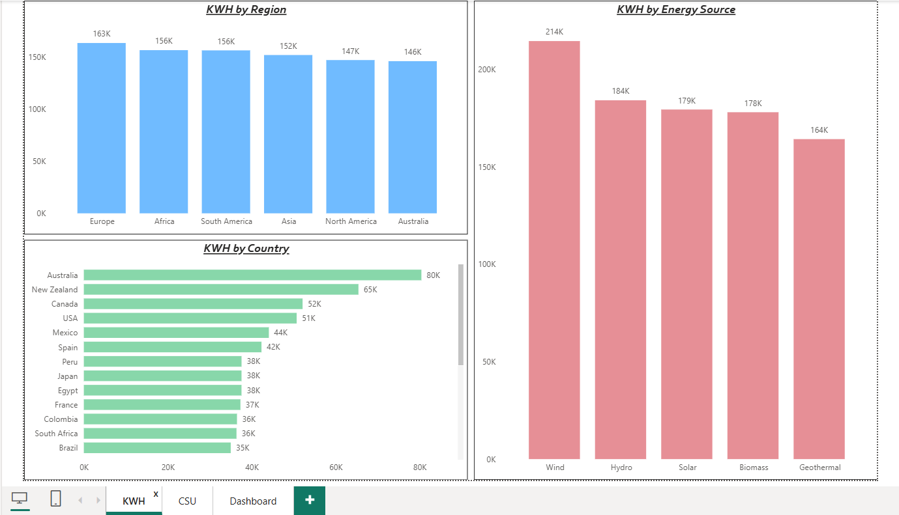
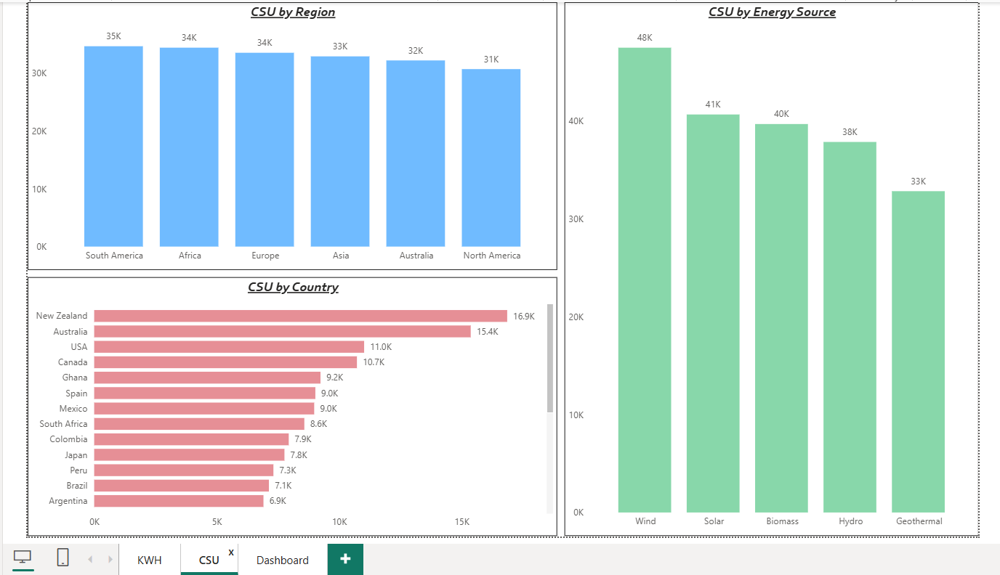
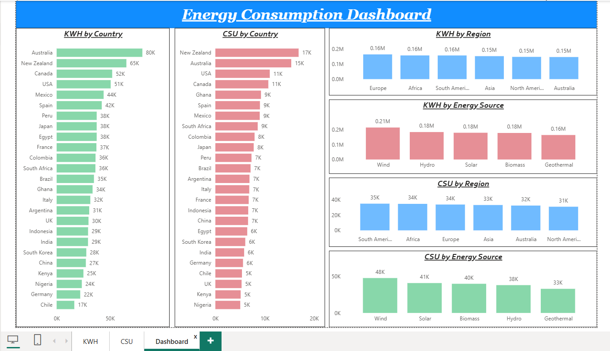

# ⚡ Energy Consumption Analysis – Regional Trends, Energy Sources & Sustainability Dashboard

An interactive **Power BI dashboard** built on a global **energy consumption dataset** to analyze electricity usage (KWH), clean energy production (CSU), and energy source distribution across regions and countries.  
This project helps understand global energy patterns, regional demand differences, and the contribution of renewable energy sources.

---

## 🎯 Project Objective

To analyze global energy consumption data and track:

- Regional electricity usage (KWH) distribution  
- Clean and sustainable energy usage (CSU) trends  
- Energy consumption patterns by country  
- Contribution of different energy sources (Wind, Solar, Hydro, Biomass, Geothermal)  
- Comparative performance of regions in energy generation and sustainability  

---

## 📸 Dashboard Preview

---

## 🛠️ Tech Stack

- **Power BI** – Dashboard development & visualization  
- **Power Query** – Data cleaning & transformation  
- **DAX** – Measures for KWH and CSU calculations  
- **Excel / CSV** – Source dataset  

---

## 📂 Dataset Used

🔗 [Energy Consumption Dataset](data/Renewable_Energy_Usage_Sampled.csv)

---

## ❓ Key Questions (KPIs)

- Which region consumes the highest electricity (KWH)?  
- Which countries lead in energy consumption and sustainability metrics?  
- How does clean sustainable usage (CSU) vary across regions?  
- Which energy source contributes the most to total consumption?  
- How does renewable energy contribution compare across regions?  

---

## ⭐ Features

- Region-wise KWH comparison using column charts  
- Country-wise consumption ranking visuals  
- Energy source contribution analysis  
- CSU comparison by region and country  
- Clean and structured multi-visual dashboard layout  
- Interactive filtering for dynamic energy analysis  

---

## 🔗 Dashboard File

Download the full Power BI project:  
📁 [Energy_Consumption_Dashboard.pbix](dashboard/Energy_consumption_project.pbix)

---

## 🔄 Process / Workflow

- Cleaned and structured raw energy data using Power Query  
- Created DAX measures for KWH and CSU aggregation  
- Designed region and country comparison visuals  
- Built energy source breakdown charts  
- Organized dashboard layout for clarity and insight-driven storytelling  

---

## 🔍 Project Insights

- Wind energy shows the highest overall contribution among energy sources.  
- Certain regions demonstrate stronger sustainable energy adoption.  
- Country-level analysis highlights significant variation in energy demand.  
- Clean energy contribution differs noticeably between developed and developing regions.  
- Renewable energy trends indicate gradual diversification of energy sources globally.  

---

## 🧾 Final Conclusion

This Energy Consumption dashboard delivers a structured and comparative view of global electricity usage and renewable energy contribution.  
It enables better understanding of regional demand, sustainability trends, and the evolving global energy landscape through clear and interactive visual analysis.

---
